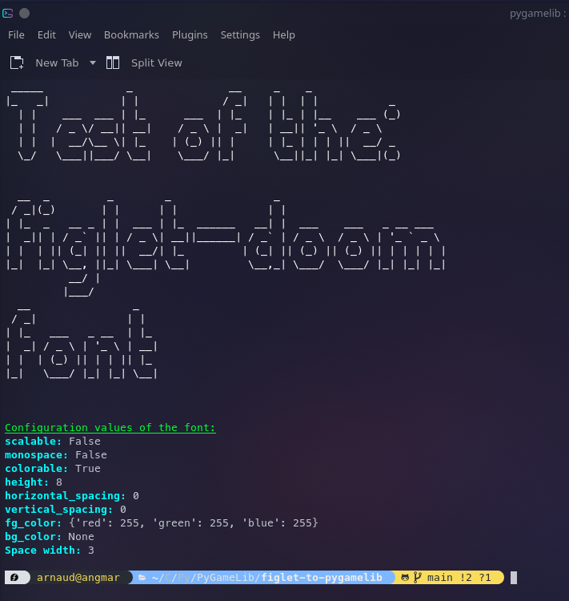

# figlet-to-pygamelib
A small script to automatically convert Figlet fonts to the Pygamelib's sprite format.

## Usage

The easy way:

    figlet-to-pygamelib.py <figlet font name>

The script accept some options:

 - -h, --help:            show the help message and exit
 - --scalable, --no-scalable:
                        Declare the font as scalable. You have to make sure that it is actually scalable. (default: False)
 - --monospace, --no-monospace:
                        Declare the font as monospace. It means that all characters have the same width. In that case, the width of the font is the width of the widest
                        character. (default: False)
 - --output-directory OUTPUT_DIRECTORY:
                        Specify the output directory. If set, all files generated will be store in that directory. If not, files are going to be stored in the current directory.
                        The entire directory structure will be created if it does not exist.
 - --space-width SPACE_WIDTH:
                        Specify the space character width. Sometimes the one in the Figlet font does not work/look good for the game. You can define the width of the space
                        character and test different values.
 - --preview, --no-preview:     Show a preview rendering of the freshly created font. (default: True)

Let's see some notions in more details.

### Scalable

A font in the `pygamelib` is a collection of sprites that each represent a glyph. A sprite can be scaled up and down.
If you set your font to be scalable, you must ensure that it correctly scales withing decent boundaries.
For example, from 0.5 to 2.
It is advised to document the validated scaling range.

### Monospace

If you set your font to be monospace, the script will enforce the same width for all the glyph. At the moment, it uses
the Figlet widest glyph as a reference.

### Space width

Unfortunately, some default settings from the Figlet fonts don't work so well with the `pygamelib`. This is the case for
the space. Some times, it just look too small or too big. Therefor, the --space-width is here to help.
When, you think that the spaces look weird you can fix them to a more suitable size.

### Examples

Generate a font from the doom Figlet font, with a space width of 3, skip the preview and store it in the dev_tests 
directory:

    figlet-to-pygamelib.py --output-directory dev_tests doom --no-preview --space-width 3

This will produce the following output:

```bash
Loading font: doom...done
Space width: 3
Generating sprites...done
Writting files...done
Configuration values of the font:
scalable:: False
monospace:: False
colorable:: True
height:: 8
horizontal_spacing:: 0
vertical_spacing:: 0
fg_color:: {'red': 255, 'green': 255, 'blue': 255}
bg_color:: None
```

Same thing but with a preview shown:

    figlet-to-pygamelib.py --output-directory dev_tests doom --space-width 3

This will produce the following output:


## Bugs

Please report bugs and feature requests here:  
[https://github.com/pygamelib/figlet-to-pygamelib/issues](https://github.com/pygamelib/figlet-to-pygamelib/issues)